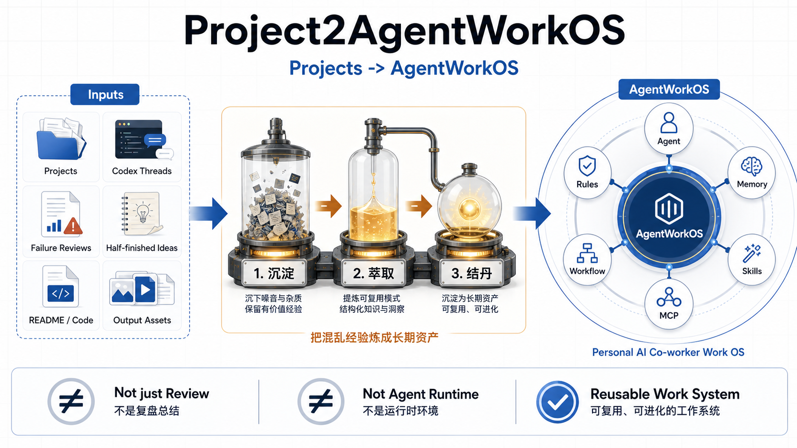
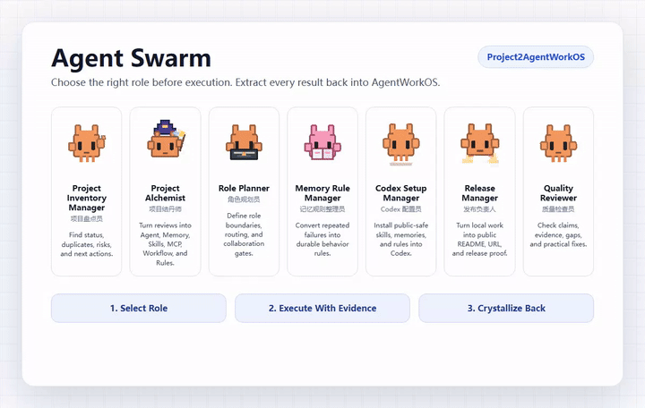

# Project2AgentWorkOS: Transfer All Projects and Threads into AgentWorkOS

> Turn every project, Codex thread, failure review, half-finished idea, README, codebase, and output asset into a reusable personal AI co-worker work operating system.
>
> 中文定位：把所有项目、Codex 对话、失败复盘和半成品，沉淀、萃取、结丹为 `AgentWorkOS`。

<p align="center">
  
</p>

<!-- showcase:start -->
<p align="center">
  
</p>

<p align="center">
  <a href="./showcase/agent-swarm.html">Agent Swarm HTML preview</a>
  ·
  <a href="./docs/readme-assets/agent-swarm.mp4">MP4 demo</a>
  ·
  <a href="./docs/readme-assets/agent-swarm.png">Static screenshot</a>
</p>
<!-- showcase:end -->

## What This Is

`Project2AgentWorkOS` is the public repository name and the method name. A local folder may use a numeric prefix such as `13-Project2AgentWorkOS` only for personal workspace sorting.

`Project2AgentWorkOS` is not a forced name for "another OS".

It is a method and repository for converting **all real work traces** into `AgentWorkOS`:

| Input | Transfer Process | Output |
|---|---|---|
| Projects | 沉淀 | Agent |
| Codex threads | 萃取 | Memory |
| Failure reviews | 结丹 | Skills |
| Half-finished ideas | OPC loop | MCP |
| README / code / docs | Project cards | Workflow |
| Output assets | Release reviews | Rules |
| Repeated discipline gaps | Lifecycle automation | Hooks |

In one sentence:

```text
Project2AgentWorkOS transfers all projects, threads, failures, and unfinished work into AgentWorkOS: Agents, Memory, Skills, MCP, Workflow, Rules, and Hooks.
```

## Why It Is Called AgentWorkOS

`AgentWorkOS` means **AI co-worker work operating system**.

It is not an Agent runtime, not a replacement for AgentOS frameworks, and not just a project management note. The `OS` here means a reusable work system with seven layers:

| Layer | Meaning |
|---|---|
| Agent | Which AI co-workers should exist |
| Memory | Which experience rules must be remembered |
| Skills | Which repeatable capabilities should be packaged |
| MCP | Which tools and connectors each Agent needs |
| Workflow | How projects move from idea to release |
| Rules | Which mistakes must never repeat |
| Hooks | Which lifecycle checks must run automatically |

In short:

```text
AgentWorkOS = Agents + Memory + Skills + MCP + Workflow + Rules + Hooks
```

Hook is the key layer that moves AgentWorkOS from a knowledge system toward an execution system.

`Project2AgentWorkOS` is the refinery. `AgentWorkOS` is the operating system produced by that refinery.

## Is This Just Claude Files Or Harness Engineering?

Short answer: no. Claude/Codex files and harness engineering are important parts of the stack, but they are not the whole system.

| Layer | What it does | Example |
|---|---|---|
| Assistant files | Store instructions for one assistant or one repo | `CLAUDE.md`, `AGENTS.md`, Codex memories |
| Harness engineering | Runs agents and tools in a controlled execution environment | CLI, MCP, sandbox, browser, GitHub, shell |
| AgentWorkOS | Defines how all project experience becomes reusable work capability | Agent roles, memory rules, skills, workflows, release gates, lifecycle hooks |

So the boundary is:

```text
Claude/Codex files = where some rules live
Harness engineering = how agents execute work
AgentWorkOS = what the human-AI work system remembers, repeats, forbids, automates, and improves
```

This project uses assistant files and harness tools, but its goal is larger: transfer all projects and threads into a durable work system.

## Agent Swarm

`AgentWorkOS` runs as an **Agent Swarm**: a role library that is selected before execution, not a pile of decorative personas.

For each task, the system chooses:

1. A **primary role** that owns the work.
2. An optional **verifier role** that checks evidence, release quality, or memory extraction.
3. A final **crystallization step** that turns useful work back into Agent, Memory, Skills, MCP, Workflow, Rules, or Hooks.

The first public role set:

| Avatar | Role | When to use | What it must produce |
|---|---|---|---|
|  | **Project Inventory Manager**<br />项目盘点员 | Scan projects, folders, repos, outputs, and status | Inventory, status, duplicates, next action |
|  | **Project Alchemist**<br />项目结丹师 | Turn project summaries, reviews, and reflections into AgentWorkOS upgrades | Seven-layer extraction: Agent, Memory, Skills, MCP, Workflow, Rules, Hooks |
|  | **Role Planner**<br />角色规划员 | Design role responsibilities, routing, and collaboration rules | Role cards, selection rules, collaboration gates |
|  | **Memory Rule Manager**<br />记忆规则整理员 | Convert repeated failures and useful threads into durable rules | One-sentence memory, trigger, default behavior |
|  | **Codex Setup Manager**<br />Codex 配置员 | Install distilled skills, memories, and rules into local `.codex` | Public source path, local target path, privacy check |
|  | **Release Manager**<br />发布负责人 | Publish GitHub repos and prepare public proof | Repo URL, README proof, topics, release gaps |
|  | **Quality Reviewer**<br />质量检查员 | Stop hype, check evidence, and find missing artifacts | Findings, missing proof, practical fixes |

Agent Swarm GIF preview:

<p align="center">
  
</p>

Default routing:

| Task | Primary role | Verifier role |
|---|---|---|
| Scan a workspace | Project Inventory Manager | Quality Reviewer |
| Distill a thread into memory | Memory Rule Manager | Project Alchemist |
| Build or install a Codex skill | Codex Setup Manager | Quality Reviewer |
| Publish a GitHub repo | Release Manager | Quality Reviewer |
| Design new Agent roles | Role Planner | Project Alchemist |
| Reflect on a stalled project | Project Alchemist | Memory Rule Manager |

This is the practical meaning of Agent Swarm here: before doing work, choose the right AI co-worker role; after doing work, extract the result back into the operating system.

Motion note: the role table uses animated SVGs as progressive enhancement. The showcase GIF above is the stable README demo, generated by the `readme-showcase-screenshot` pipeline.

## Core Mission

Most personal AI projects do not fail because of weak ideas. They fail because work traces never become reusable assets:

- Projects start faster than they are closed.
- Threads contain decisions but do not become memory.
- README files improve, but release proof is missing.
- Similar projects repeat instead of merging.
- Agent roles stay implicit, so one AI assistant does everything.
- Failure reviews exist once, then disappear from the next project.

This project makes one rule explicit:

> Every meaningful project and thread must either be archived, published, or distilled into AgentWorkOS.

## Repository Map

| Path | Purpose |
|---|---|
| `README.md` | GitHub homepage and positioning |
| `assets/` | Visual diagrams and README images |
| `docs/` | Failure review, project scans, strategy documents |
| `agents/` | AI co-worker role system |
| `agents/role-library/` | Role cards selected before execution |
| `memory/` | Long-term operating rules |
| `codex/` | Public-safe Codex skill, memory, and rule adapters |
| `docs/HOOKS_AND_AGENTWORKOS.md` | Hook boundary and execution-discipline model |
| `templates/` | Repeatable project, thread, release, and weekly review templates |

## Current Artifacts

| Artifact | Status |
|---|---|
| Full workspace failure review | Drafted |
| Codex thread scan summary | Drafted |
| OPC Agent role system | Drafted |
| Long-term memory rules | Drafted |
| Agent role library | Added |
| Agent role SVG avatars | Added |
| Animated Agent Swarm GIF | Added |
| Agent Swarm README walkthrough | Added |
| Local Codex integration package | Added |
| Local Codex self-install evidence | Added |
| `.codex` substrate boundary doc | Added |
| Hook boundary doc | Added |
| Concept map image | Added to README |
| Project card template | Added |
| Thread distillation template | Added |
| Release checklist | Added |
| Weekly review template | Added |

## How To Use

1. Pick one project, thread, or unfinished idea.
2. Select a primary role and optional verifier role from the Agent Swarm.
3. Fill `templates/PROJECT_CARD.template.md`.
4. Extract decisions with `templates/THREAD_DISTILLATION.template.md`.
5. Convert the output into one or more of the seven AgentWorkOS layers.
6. Use `templates/RELEASE_CHECKLIST.md` before publishing.
7. End each week with `templates/WEEKLY_REVIEW.template.md`.

The goal is not to create more documents. The goal is to stop losing useful work.

## Self-Experiment First

This project must prove itself on the author's own workspace before making broad claims.

Current self-experiment evidence:

- Personal project failure review is open-sourced in `docs/`.
- Repeated failures are distilled into `memory/`.
- AI co-worker roles are distilled into `agents/role-library/`.
- A portable Codex skill is prepared in `codex/skills/project2agentworkos/`.
- Public-safe Codex memory and rules are prepared in `codex/memories/` and `codex/rules/`.
- The Codex package has been installed back into the author's local `.codex` as a self-experiment.
- Raw `.codex` state is not published; only distilled content is published.

## Local Codex Usage

`Project2AgentWorkOS` can be installed into local Codex as a skill/memory/rule set:

| Public source | Local target |
|---|---|
| `codex/skills/project2agentworkos/` | `<codex-home>/skills/project2agentworkos/` |
| `codex/memories/project2agentworkos.md` | `<codex-home>/memories/project2agentworkos.md` |
| `codex/rules/project2agentworkos.rules` | `<codex-home>/rules/project2agentworkos.rules` |

See [Codex Substrate And AgentWorkOS](./docs/CODEX_SUBSTRATE_AND_AGENTWORKOS.md) for the boundary between `.codex` and `AgentWorkOS`.

## The Transfer Rule

```text
All projects + all threads + all failures + all half-finished assets
-> Project2AgentWorkOS
-> AgentWorkOS
-> future projects move faster and repeat fewer mistakes
```

## Near-Term Focus

- Freeze this repository as the main home for the personal AI work system.
- Move the current product workspace review into `docs/`.
- Convert high-frequency failures into `memory/`.
- Convert repeated assistant behaviors into `agents/`.
- Convert repeatable workflows into `templates/` and future `skills/`.
- Convert repeated lifecycle checks into `hooks/` or hook-ready rules.
- Use this repository's own `codex/` package inside local Codex.
- Publish a clear GitHub README before adding more features.

## Related Documents

- [Workspace Failure Review](./docs/PROJECT_FAILURE_REVIEW_AND_OPC_AGENT_SYSTEM.md)
- [OPC Agent Role System](./agents/OPC_AGENT_ROLE_SYSTEM.md)
- [Agent Role Library](./agents/role-library/README.md)
- [Long-Term Memory Rules](./memory/OPC_LONG_TERM_MEMORY_RULES.md)
- [Codex Substrate And AgentWorkOS](./docs/CODEX_SUBSTRATE_AND_AGENTWORKOS.md)
- [Hooks And AgentWorkOS](./docs/HOOKS_AND_AGENTWORKOS.md)
- [Self-Experiment Log](./docs/SELF_EXPERIMENT_LOG.md)
